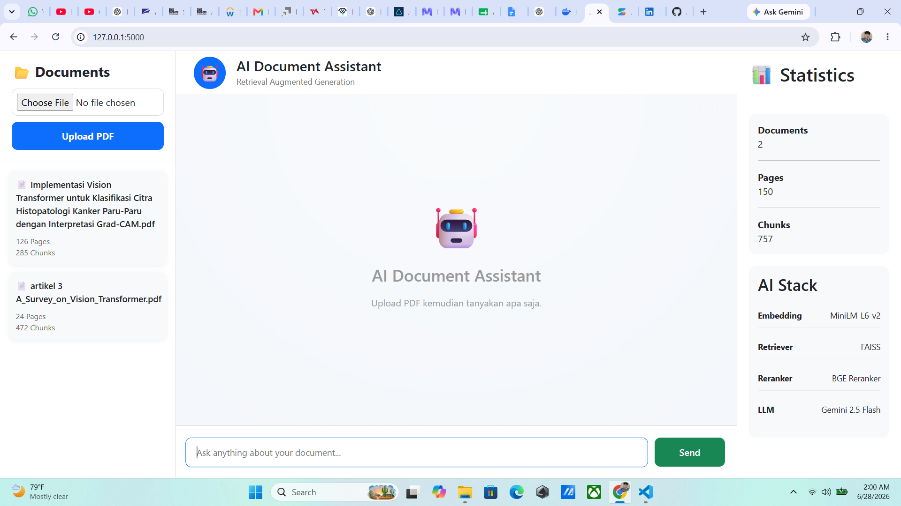
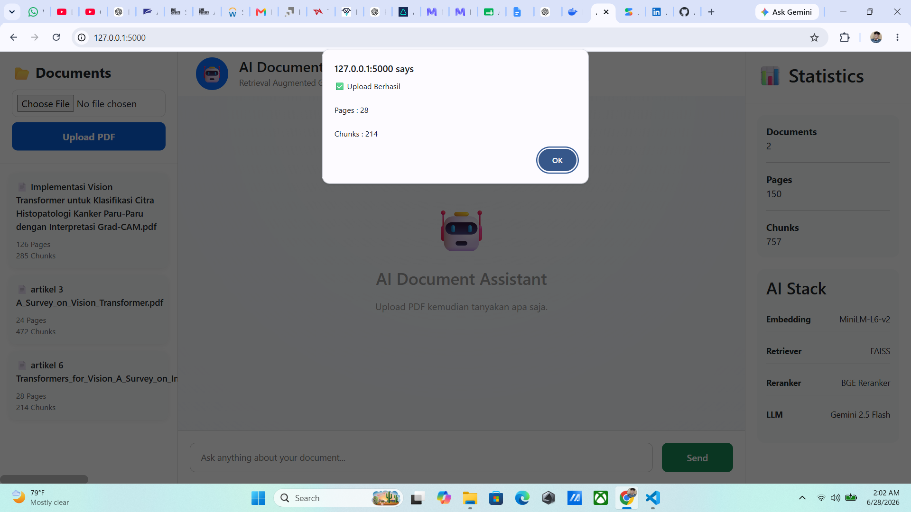
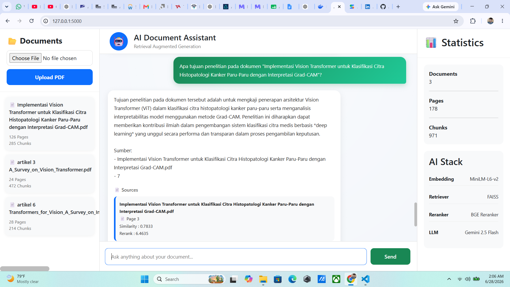

# 🤖 AI Document Assistant (RAG)

> An intelligent document question-answering system powered by Retrieval-Augmented Generation (RAG), Semantic Search, FAISS, CrossEncoder Reranking, and Google Gemini.


---

# 📌 Overview

AI Document Assistant is a Retrieval-Augmented Generation (RAG) application that allows users to upload one or multiple PDF documents and ask natural language questions about their contents.

Instead of relying solely on a Large Language Model, the system retrieves the most relevant document chunks using semantic search, reranks them using a CrossEncoder model, and then sends only the most relevant context to Google Gemini for answer generation.

This approach significantly improves answer accuracy while reducing hallucinations.

---

# ✨ Features

- 📄 Upload multiple PDF documents
- 🔍 Semantic document retrieval
- 🧠 Sentence Transformer Embedding
- ⚡ FAISS Vector Search
- 🎯 CrossEncoder Reranking
- 🤖 Google Gemini 2.5 Flash
- 📚 Source citation (document & page)
- 📊 Document statistics
- 💬 Interactive chat interface
- 🖥️ Flask Web Application

---

# 🏗 System Architecture

```

                PDF Documents
                     │
                     ▼
              PDF Text Extraction
                     │
                     ▼
                 Chunking
                     │
                     ▼
      SentenceTransformer Embedding
                     │
                     ▼
               FAISS Vector Store
                     │
                     ▼
          Semantic Similarity Search
                     │
                     ▼
            CrossEncoder Reranker
                     │
                     ▼
          Google Gemini 2.5 Flash
                     │
                     ▼
             Final Answer + Sources

```

---

# 🛠 Tech Stack

| Component | Technology |
|------------|------------|
| Backend | Flask |
| Embedding | all-MiniLM-L6-v2 |
| Vector Database | FAISS |
| Reranker | BAAI/bge-reranker-base |
| LLM | Gemini 2.5 Flash |
| PDF Parser | PyMuPDF |
| Frontend | HTML, CSS, JavaScript |

---

# 📂 Project Structure

```

ProjectRAG/

│

├── app.py

├── rag.py

├── retriever.py

├── reranker.py

├── llm.py

├── add_document.py

├── build_index.py

├── embedding.py

├── pdf_loader.py

├── chunker.py

├── config.py

│

├── uploads/

├── vector_db/

├── static/

│ ├── style.css

│ └── script.js

│

├── templates/

│ └── index.html

│

├── requirements.txt

└── README.md

```

---

# 🚀 Installation

Clone repository

```bash
git clone https://github.com/YOUR_USERNAME/AI-Document-Assistant.git

cd AI-Document-Assistant
```

Create virtual environment

```bash
python -m venv .venv
```

Activate environment

Windows

```bash
.venv\Scripts\activate
```

Linux / Mac

```bash
source .venv/bin/activate
```

Install dependencies

```bash
pip install -r requirements.txt
```

---

# 🔑 Configure API Key

Create a `.env` file.

```

GEMINI_API_KEY=YOUR_API_KEY

```

---

# ▶ Run Application

```bash
python app.py
```

Open

```

http://127.0.0.1:5000

```

---

# 📄 Usage

### Upload PDF

Choose one or more PDF documents.

The application automatically:

- Extracts text
- Splits into chunks
- Generates embeddings
- Stores vectors in FAISS

---

### Ask Questions

Example:

```

What dataset is used in this thesis?

```

```

Explain Vision Transformer.

```

```

What is the research objective?

```

---

# 🔍 Retrieval Pipeline

1. User submits a question.
2. SentenceTransformer converts the question into an embedding.
3. FAISS retrieves the Top-K similar chunks.
4. CrossEncoder reranks retrieved chunks.
5. The highest-ranked chunks are sent to Gemini.
6. Gemini generates an answer based only on retrieved context.
7. The application displays answer and source references.

---

# 📸 Screenshots

## 🏠 Home




## 📄 Upload PDF



## Chat


## 💬 Question Answering



---

# 📈 Future Improvements

- Docker Deployment
- Qdrant Vector Database
- User Authentication
- Conversation Memory
- OCR Support
- Streaming Response
- Drag & Drop Upload
- Citation Highlighting

---

# 👨‍💻 Author

**Ade Verdaus Saputra*

GitHub:

https://github.com/Adeverdauss

LinkedIn:

https://www.linkedin.com/in/adeverdaussaputra/

---

# ⭐ If you find this project useful, consider giving it a star!
